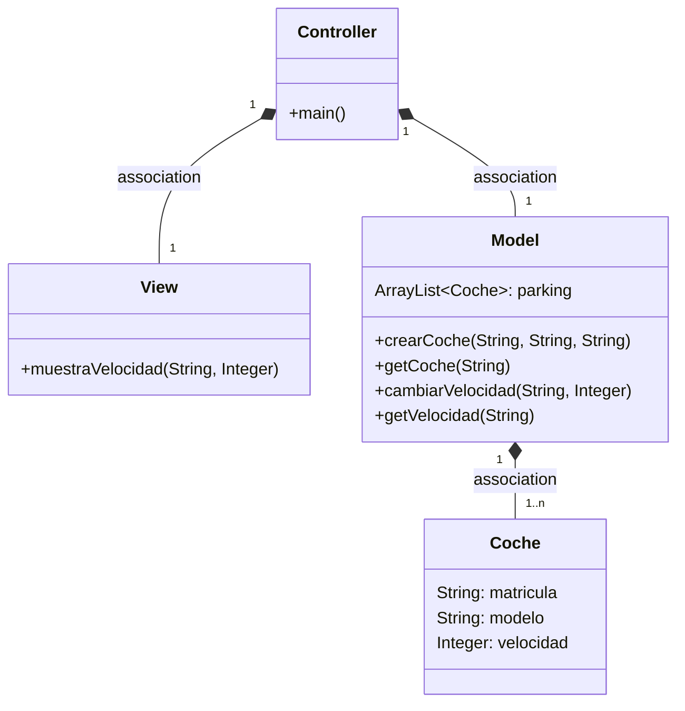
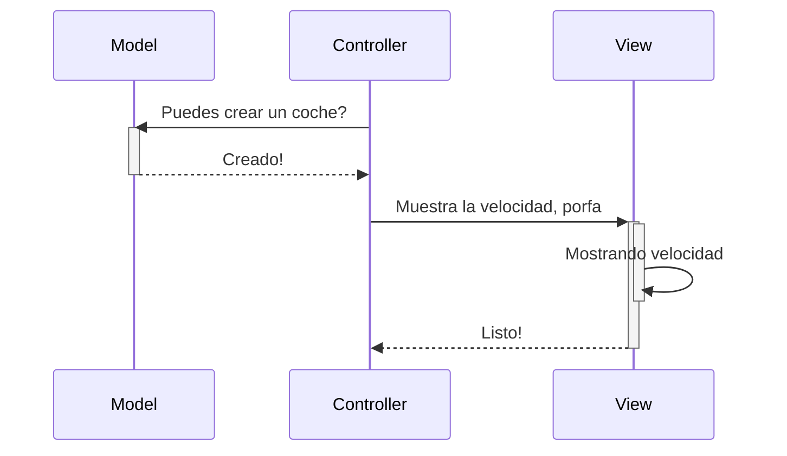
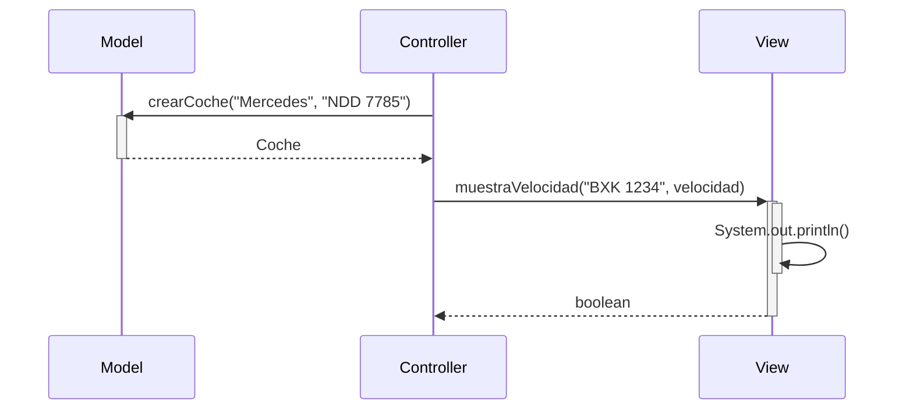

# Arquitectura MVC

Este programa implementa un sistema de gestión de coches utilizando el patrón MVC. Se ha añadido un nuevo observer, `ObsExceso`, que muestra una alerta cuando la velocidad de un coche supera los 120 km/h.

## Modificaciones:

- Se ha agregado la clase `ObsExceso` que implementa la interfaz `Observer`.
- Cuando se actualiza la velocidad de un coche, el nuevo observer verifica si supera los 120 km/h.
- Si la velocidad excede el límite, se muestra una alerta de "Velocidad Excedida" utilizando un diálogo, en el caso de que el coche no supere el velocidad límite el programa continua mostrando la velocidad del coche en cuestión.

---
## Diagrama de clases:

---

## Diagrama de Secuencia

Ejemplo básico del procedimiento, sin utilizar los nombres de los métodos

El mismo diagrama con los nombres de los métodos

