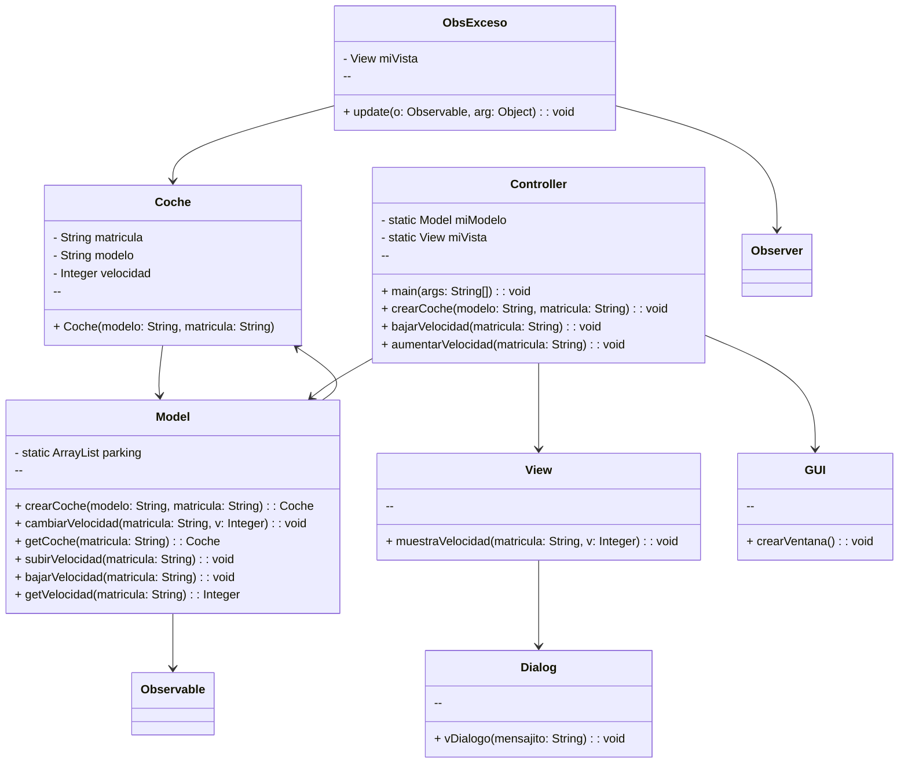

# Arquitectura MVC

Este programa implementa un sistema de gestión de coches utilizando el patrón MVC. Se ha añadido un nuevo observer, `ObsExceso`, que muestra una alerta cuando la velocidad de un coche supera los 120 km/h.

## Modificaciones:

- Se ha agregado la clase `ObsExceso` que implementa la interfaz `Observer`.
- Cuando se actualiza la velocidad de un coche, el nuevo observer verifica si supera los 120 km/h.
- Si la velocidad excede el límite, se muestra una alerta de "Velocidad Excedida" utilizando un diálogo, en el caso de que el coche no supere el velocidad límite el programa continua mostrando la velocidad del coche en cuestión.


---
## Diagrama de clases:



---

## Diagrama de Secuencia

Ejemplo básico del procedimiento, sin utilizar los nombres de los métodos


```mermaid
sequenceDiagram
    participant Usuario
    participant Controller
    participant Model
    participant View
    participant GUI
    participant ObsExceso
    participant Dialog

    Usuario->>+Controller: Ejecutar programa
    Controller->>+GUI: Crear ventana
    GUI-->>-Controller: Ventana creada
    Usuario->>+Controller: Crear coche
    Controller->>+Model: Crear coche
    Model-->>-Controller: Coche creado
    Controller->>+View: Mostrar velocidad
    View-->>-Controller: Velocidad mostrada
    Controller->>+ObsExceso: Actualizar velocidad
    ObsExceso-->>-View: Mostrar alerta
    Controller->>+Model: Aumentar velocidad
    Model-->>-Controller: Velocidad actualizada
    Controller->>+View: Mostrar velocidad
    View-->>-Controller: Velocidad mostrada

    alt Velocidad excedida
    Controller->>+Dialog: Mostrar alerta
    Dialog-->>-Controller: Alerta mostrada
    end

    Controller->>+Model: Disminuir velocidad
    Model-->>-Controller: Velocidad actualizada
    Controller->>+View: Mostrar velocidad
    View-->>-Controller: Velocidad mostrada

    Usuario->>-Controller: Salir del programa
    Controller-->>-Usuario: Programa finalizado
```

El mismo diagrama con los nombres de los métodos

```mermaid
    sequenceDiagram
    participant Usuario
    participant Controller
    participant Model
    participant View
    participant GUI
    participant ObsExceso
    participant Dialog

    Usuario->>+Controller: Ejecutar programa
    Controller->>+GUI: crearVentana()
    GUI-->>-Controller: Ventana creada
    Usuario->>+Controller: crearCoche(modelo, matricula)
    Controller->>+Model: crearCoche(modelo, matricula)
    Model-->>-Controller: Coche creado
    Controller->>+View: muestraVelocidad(matricula, velocidad)
    View-->>-Controller: Velocidad mostrada
    Controller->>+ObsExceso: update(Observable, Coche)
    ObsExceso-->>-View: muestraAlertaVelocidadExcedida()
    Controller->>+Model: subirVelocidad(matricula)
    Model-->>-Controller: Velocidad actualizada
    Controller->>+View: muestraVelocidad(matricula, velocidad)
    View-->>-Controller: Velocidad mostrada

    alt Velocidad excedida
    Controller->>+Dialog: vDialogo("Alerta: Velocidad excedida!")
    Dialog-->>-Controller: Alerta mostrada
    end

    Controller->>+Model: bajarVelocidad(matricula)
    Model-->>-Controller: Velocidad actualizada
    Controller->>+View: muestraVelocidad(matricula, velocidad)
    View-->>-Controller: Velocidad mostrada

    Usuario->>-Controller: Salir del programa
    Controller-->>-Usuario: Programa finalizado
```


